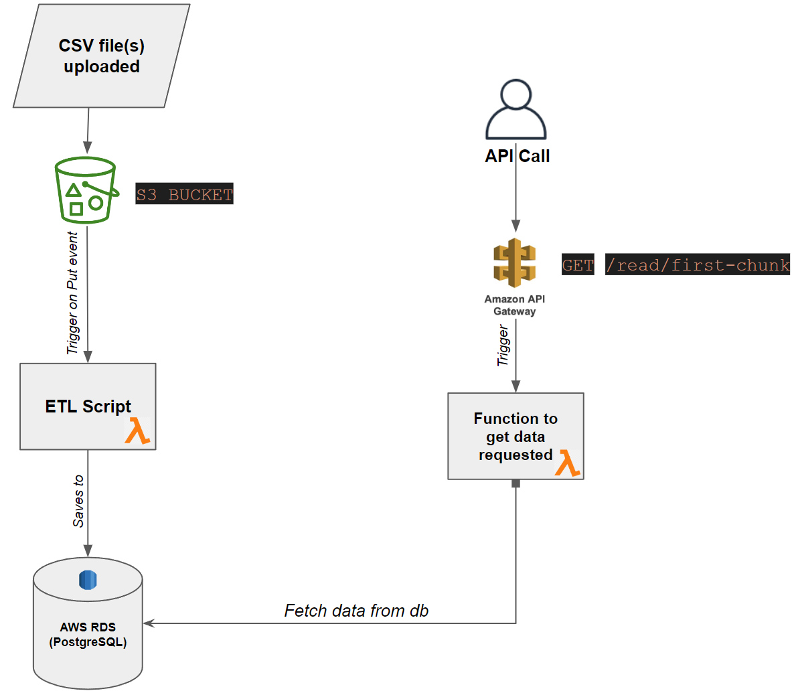

# Home Task - Data Engineer - 1
## Setup
***OS used: Ubuntu 20.04.6***
1. Clone the repository:

   ```bash
   git clone https://github.com/OussemaHdr/home-task-1.git
   cd home-task-1
   ```
   ```bash
   pip install -r requirements.txt
2. PostgreSQL Configuration:  
[Link to install PostgreSQL](https://www.postgresql.org/download/).  
Start the Postgres service:  
    ```bash
    sudo service postgresql start
    ```
    Run the setup bash script to create the Postgres db, user and table (all the variables used here will be used to run the rest of the scripts): 
    ```bash
    chmod +x postgres_setup.sh
    ./postgres_setup.sh <database_name> <username> <password> <table_name>
    ```
## Running the ETL Pipeline  
Run the ETL pipeline to read the CSV sample, transform the data, and load it into the PostgreSQL db:  
```bash
python etl/etl.py data/sample.csv <database_name> <username> <password> <table_name>
```
## Testing the ETL Pipeline  
Run simple unit tests to verify the functions are returning results and that the results are of the expected type:
```bash
python test_load.py
python test_transform.py
```
## Running the REST API
Run the REST API to expose an endpoint for retrieving data from the PostgreSQL db:
```bash
python api/api.py
```
## Testing the API
Run the test script to send a request to the API and print the response:
```bash
python api/test_api.py  <database_name> <username> <password> <table_name>
```
## Deployment system diagram (AWS) and explanation 
[Link to imgur in case the image doesn't load](https://imgur.com/a/FElJkyH).  


1. **Data loading:**  
    - In the diagram above I'm going with a fully automated pipeline that runs whenever new data comes in - this is acheived by having a Lambda function *containing our ETL script* that triggers when a file(s) is uploaded.  
        - *AWS Lambda allow for up to 1000 concurent runs (free tier) which would help in case multiple files are uploaded in quick succession.*  
    - This function would process the data and add it to our PostgreSQL table hosted on AWS RDS.  
2. **API Gateway Configuration:**
    - Set up an API in Amazon API Gateway with the route /read/first-chunk.
    - Configure the API to integrate with an AWS Lambda function.
3. **Lambda Function to fetch data:**  
    - A Lambda function that handles the fetching of data from the PostgreSQL database.
    - This function will be triggered when a request is received through the API Gateway.  

Alternatively 2 and 3 this also can be achieved by using *the Serverless framework* which would be my preferred aproach.  

4. **Client Response:**  
    - API Gateway receives the response from the Lambda function.  
    - The structured response is returned to the client that made the API request.

Overall this architecture enables a scalable and serverless approach where the API Gateway and AWS Lambda handle the request, interact with the database, and return the response to the client.

